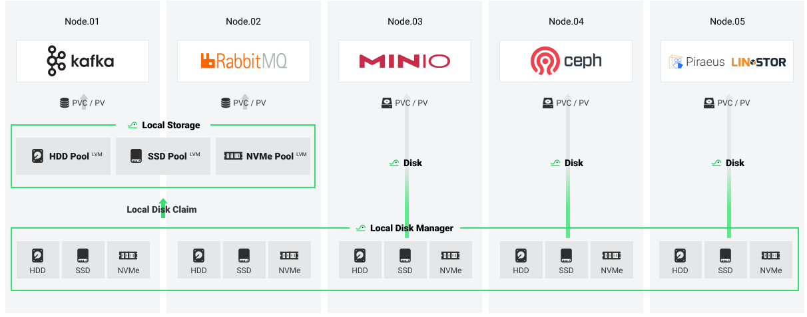

# HwameiStor

HwameiStor is an HA local storage system for cloud-native stateful workloads.
It creates a local storage resource pool for centrally managing all disks such as HDD, SSD, and NVMe.
It uses the CSI architecture to provide distributed services with local volumes and provides data
persistence capabilities for stateful cloud-native workloads or components.

## Current Status

HwameiStor is a cloud-native storage project listed in [CNCF Landscape](https://landscape.cncf.io/?selected=hwamei-stor),
with capabilities to support for your production environment.

> At present, HwameiStor is still in the alpha stage.

The latest release of HwameiStor is 

## Build Status

  

## Release Status

| Release | Version | Type   |
|---------|---------|--------|
| v0.6    | v0.6.0  | latest |

See [current releases](https://github.com/hwameistor/hwameistor/releases).

## Running Environments

### Kubernetes compatiblity
| kubernetes | v0.4.3     | >=v0.5.0 |
| ---------- | ---------- |-------|
| >=1.18&&<=1.20 | Yes   | No    | 
| 1.21       | Yes   | Yes  | 
| 1.22       | Yes    | Yes  | 
| 1.23       | Yes    | Yes  | 
| 1.24       | Yes    | Yes  | 
| 1.25       | No | Yes | 

## Modules and Code

HwameiStor contains several modules:

* [local-disk-manager](#local-disk-manager)
* [local-storage](#local-storage)
* [scheduler](#scheduler)
* [admission-controller](#admission-controller)
* [Evictor](#evictor)
* [DRDB installer](#drbd-installer)

### local-disk-manager

local-disk-manager (LDM) is designed to hold the management of disks on nodes.
Other modules such as local-storage can take advantage of the disk management feature provided by LDM.
[Learn more](docs/docs/architecture/modules/ldm.md)

### local-storage

local-storage (LS) provides a cloud-native local storage system.
It aims to provision high-performance persistent LVM volume with local access to applications.
[Learn more](docs/docs/architecture/modules/ls.md)

### Scheduler

Scheduler is to automatically schedule a pod to a correct node which has the associated HwameiStor volumes.
[Learn more](docs/docs/architecture/modules/scheduler.md)

### admission-controller

admission-controller is a webhook that can automatically determine which pod uses the HwameiStor volume and,
help to modify the schedulerName to hwameistor-scheduler.
[Learn more](docs/docs/architecture/modules/admission_controller.md)

### Evictor

Evictor is used to automatically migrate HwameiStor volumes in case of node or pod eviction.
When a node or pod is evicted as either Planned or Unplanned, the associated HwameiStor volumes,
which have a replica on the node, will be detected and migrated out this node automatically.
[Learn more](docs/docs/architecture/modules/evictor.md)

## DRBD installer

DRBD (Distributed Replicated Block Device) is composed of Linux kernel modules and related scripts
to build high available clusters. It is implemented by mirroring the entire device over the network,
which can be thought of as a kind of network RAID. This installer can directly install DRBD to a
container cluster. Currently this module is only for testing purposes.
[Learn more](docs/docs/architecture/modules/drbd.md)

## Documentation

For full documentation, please see our website [hwameistor.io](https://hwameistor.io/docs/intro).

## Roadmap

| Feature                                   | Status        | Release   |  Description                                      |
|------------------------------------------ |-----------    |---------  |-------------------------------------------------- |
| CSI for LVM volume                        | Completed     | v0.3.2    | Provision volume with lvm                         |
| CSI for disk volume                       | Completed     | v0.3.2    | Provision volume with disk                        |
| HA LVM Volume                             | Completed     | v0.3.2    | Volume with HA                                    |
| LVM Volume expansion                      | Completed     | v0.3.2    | Expand LVM volume capacity online                 |
| LVM Volume conversion                     | Completed     | v0.3.2    | Convert a non-HA LVM volume to the HA             |
| LVM Volume migration                      | Completed     | v0.4.0    | Migrate a LVM volume replica to a different node  |
| Volume Group                              | Completed     | v0.3.2    | Support volume group allocation                   |
| LVM HA Volume Recovery                    | Planed        |           | Recover the LVM HA volume in problem              |
| HwameiStor Operator                       | Planed        |           | Operator for HwameiStor install, maintain, etc..  |
| Observability                             | Planed        |           | Observability, such as metrics, logs, etc..       |
| Failover                                  | Planed        |           | Fail over the pod with HwameiStor volume          |
| IO throttling                             | Planed        |           | Limit IO bandwith to access the HwameiStor volume |
| Disk health check                         | Planed        |           | Disk fault prediction, status reporting           |
| Disk replacement                          | Planed        |           | Replace disk which fails or will fail soon        |
| LVM volume auto-expansion                 | Planed        |           | Expand LVM volume automatically                   |
| LVM volume snapshot                       | Planed        |           | Snapshot of LVM volume                            |
| LVM volume clone                          | Unplaned      |           | Clone LVM volume                                  |
| LVM volume thin provision                 | Unplaned      |           | LVM volume thin provision                         |
| LVM volume stripe mode                    | Unplaned      |           | LVM volume stripe read/write                      |
| Data encryption                           | Unplaned      |           | Data encryption                                   |

## Community

### Blog

Please follow our weekly blogs [here](https://hwameistor.io/blog).

### Slack

Our slack channel is [here](https://join.slack.com/t/hwameistor/shared_invite/zt-1dkabcq2c-KIRBJDBc_GgZZfeLrooK6g)

### WeChat

HwameiStor tech-talk group:

## Discussion

Welcome to follow our roadmap discussions [here](https://github.com/hwameistor/hwameistor/discussions)

## Requests and Issues

Please feel free to raise requests on chats or by a PR.  

We will try our best to respond to every issue reported on community channels,
but the issues reported [here](https://github.com/hwameistor/hwameistor/discussions)
on this repo will be addressed first.

## License

Copyright (c) 2014-2021 The HwameiStor Authors

Licensed under the Apache License, Version 2.0 (the "License");
you may not use this file except in compliance with the License.
You may obtain a copy of the License at
<http://www.apache.org/licenses/LICENSE-2.0>
