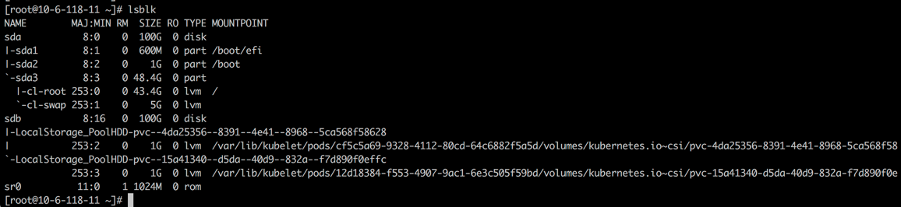
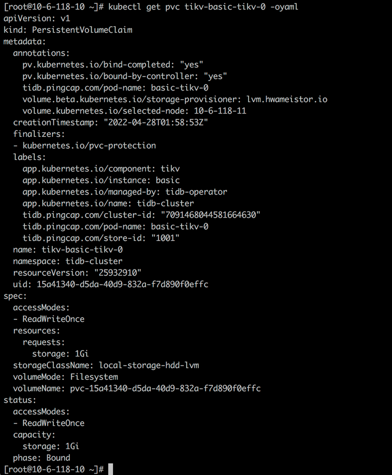

This test environment is Kubernetes 1.22. We deployed TiDB 1.3 after the HwameiStor local storage is attached. Then, we performed the basic SQL capability test, system security test, and operation and maintenance management test.

All the tests passed successfully, it is acknowledged that HwameiStor can support distributed database application scenarios such as TiDB with high availability, strong consistency requirements, and large data scale.

## Introduction to TiDB

TiDB is a distributed database product that supports OLTP (Online Transactional Processing), OLAP (Online Analytical Processing), and HTAP (Hybrid Transactional and Analytical Processing) services, compatible with key features such as MySQL 5.7 protocol and MySQL ecosystem. The goal of TiDB is to provide users with one-stop OLTP, OLAP, and HTAP solutions, which are suitable for various application scenarios such as high availability, strict requirements for strong consistency, and large data scale.

### TiDB architecture

The TiDB distributed database splits the overall architecture into multiple modules that can communicate with each other. The architecture diagram is as follows:


- **TiDB Server**
  
  The SQL layer exposes the connection endpoints of the MySQL protocol to the outside world, and is responsible for accepting connections from clients, performing SQL parsing and optimization and finally generating a distributed execution plan. The TiDB layer itself is stateless. In practice, you can start several TiDB instances. A unified access address is provided externally through load-balance components (such as LVS, HAProxy, or F5), and client connections can be evenly distributed on to these TiDB instances. The TiDB server itself does not store data, but only parses SQL and forwards the actual data read request to the underlying storage node, TiKV (or TiFlash).

- **PD (Placement Driver) Server**
  
  The metadata management module across a TiDB cluster is responsible for storing the real-time data distribution of each TiKV node and the overall topology of the cluster, providing the TiDB Dashboard management and control interface, and assigning transaction IDs to distributed transactions. Placement Driver (PD) not only stores metadata, but also issues data scheduling commands to specific TiKV nodes based on the real-time data distribution status reported by TiKV nodes, which can be said to be the "brain" of the entire cluster. In addition, the PD itself is also composed of at least 3 nodes and has high availability capabilities. It is recommended to deploy an odd number of PD nodes.

- **Storage nodes**
	
	- TiKV Server: In charge of storing data. From the outside, TiKV is a distributed Key-Value storage engine that provides transactions. The basic unit for storing data is Region. Each Region is responsible for storing the data of a Key Range (the block between left-closed and right-open from StartKey to EndKey). Each TiKV node is responsible for multiple Regions. TiKV API provides native support for distributed transactions at the KV key-value pair level, and provides the levels of Snapshot Isolation (SI) by default, which is also the core of TiDB's support for distributed transactions at the SQL level. After the SQL layer of TiDB completes the SQL parsing, it will convert the SQL execution plan into the actual call to the TiKV API. Therefore, the data is stored in TiKV. In addition, the TiKV data will be automatically maintained in multiple replicas (the default is three replicas), which naturally supports high availability and automatic failover.

	- TiFlash is a special storage node. Unlike ordinary TiKV nodes, data is stored in columns in TiFlash, and the main function is to accelerate analysis-based scenarios.

### TiDB database storage


- **Key-Value Pair**

  The choice of TiKV is the Key-Value model that provides an ordered traversal method. Two key points of TiKV data storage are:

  - A huge Map (comparable to std::map in C++) that stores Key-Value Pairs.

  - The Key-Value pairs in this Map are sorted by the binary order of the Key, that is, you can seek to the position of a certain Key, and then continuously call the Next method to obtain the Key-Value larger than this Key in an ascending order.

- **Local storage (Rocks DB)**
  
  In any persistent storage engine, data must be saved on disk after all, and TiKV is not different. However, TiKV does not choose to write data directly to the disk, but stores the data in RocksDB, and RocksDB is responsible for the specific data storage. The reason is that developing a stand-alone storage engine requires a lot of work, especially to make a high-performance stand-alone engine, which may require various meticulous optimizations. RocksDB is a very good stand-alone KV storage engine open sourced by Facebook. It can meet various requirements of TiKV for single engine. Here we can simply consider that RocksDB is a persistent Key-Value Map on a host.

- **Raft protocol**
  
  TiKV uses the Raft algorithm to ensure that data is not lost and error-free when a single host fails. In short, it is to replicate data to multiple hosts, so that if one host cannot provide services, replicas on other hosts can still provide services. This data replication scheme is reliable and efficient, and can deal with replica failures.

- **Region**
  
  TiKV divides the Range by Key. A certain segment of consecutive Keys are stored on a storage node. Divide the entire Key-Value space into many segments, each segment is a series of consecutive Keys, called a Region. Try to keep the data saved in each Region within a reasonable size. Currently, the default in TiKV is no more than 96 MB. Each Region can be described by a left-closed and right-open block such as [StartKey, EndKey].

- **MVCC**
  
  TiKV implements Multi-Version Concurrency Control (MVCC).

- **Distributed ACID transactions**
  
  TiKV uses the transaction model used by Google in BigTable: Percolator.

## Build the test environment

### Kubernetes cluster

In this test, we use three VM nodes to deploy the Kubernetes cluster, including one master node and two worker nodes. Kubelete version is 1.22.0.


### HwameiStor local storage

1. Deploy the HwameiStor local storage in the Kubernetes cluster

   

2. Configure a 100G local disk, sdb, for HwameiStor on two worker nodes respectively

   

   

3. Create StorageClass

   

### Deploy TiDB on Kubernetes

TiDB can be deployed on Kubernetes using TiDB Operator. TiDB Operator is an automatic operation and maintenance system for TiDB clusters on Kubernetes. It provides full lifecycle management of TiDB including deployment, upgrade, scaling, backup and recovery, and configuration changes. With TiDB Operator, TiDB can run seamlessly on public cloud or privately deployed Kubernetes clusters.

The compatibility between TiDB and TiDB Operator versions is as follows:

| TiDB  version         | Applicable versions of TiDB Operator |
| ------------------ | ------------------------- |
| dev                | dev                       |
| TiDB  >= 5.4       | 1.3                       |
| 5.1  <= TiDB < 5.4 | 1.3 (recommended), 1.2         |
| 3.0  <= TiDB < 5.1 | 1.3 (recommended), 1.2, 1.1    |
| 2.1  <= TiDB < 3.0 | 1.0 (maintenance stopped)      |

#### Deploy TiDB Operator

1. Install TiDB CRDs

   ```bash
   kubectl apply -f https://raw.githubusercontent.com/pingcap/tidb-operator/master/manifests/crd.yaml
   ```

2. Install TiDB Operator

   ```bash
   helm repo add pingcap https://charts.pingcap.org/ 
   kubectl create namespace tidb-admin 
   helm install --namespace tidb-admin tidb-operator pingcap/tidb-operator --version v1.3.2 \
   --set operatorImage=registry.cn-beijing.aliyuncs.com/tidb/tidb-operator:v1.3.2 \
   --set tidbBackupManagerImage=registry.cn-beijing.aliyuncs.com/tidb/tidb-backup-manager:v1.3.2 \
   --set scheduler.kubeSchedulerImageName=registry.cn-hangzhou.aliyuncs.com/google_containers/kube-scheduler
   ```

3. Check TiDB Operator components

   

#### Deploy the TiDB cluster

```bash
kubectl create namespace tidb-cluster && \
kubectl -n tidb-cluster apply -f https://raw.githubusercontent.com/pingcap/tidb-operator/master/examples/basic/tidb-cluster.yaml 
kubectl -n tidb-cluster apply -f https://raw.githubusercontent.com /pingcap/tidb-operator/master/examples/basic/tidb-monitor.yaml
```


#### Connect the TiDB cluster

```bash
yum -y install mysql-client
```


```bash
kubectl port-forward -n tidb-cluster svc/basic-tidb 4000 > pf4000.out & 
```


#### Check and verify the TiDB cluster status

1. Create the Hello_world table

   ```sql
   create table hello_world (id int unsigned not null auto_increment primary key, v varchar(32)); 
   ```

   

2. Check the TiDB version

   ```sql
   select tidb_version()\G;
   ```

   

3. Check the Tikv storage status

   ```sql
   select * from information_schema.tikv_store_status\G;
   ```

   

#### Configure the HwameiStor storage

Create a PVC for tidb-tikv and tidb-pd from `storageClass local-storage-hdd-lvm`:




```bash
kubectl get po basic-tikv-0 -oyaml
```


```bash
kubectl get po basic-pd-0 -oyaml
```


## Test procedure

### Basic SQL capability test

After the database cluster is deployed, we performed the following tests about basic capabilities. All are successfully passed.

#### Distributed transaction

Test purpose: In the case of multiple isolation levels, check if the completeness constraints of distributed data operations are supported, such as atomicity, consistency, isolation, and durability (ACID)

Test steps:

1. Create the database: testdb

2. Create the table `t_test ( id int AUTO_INCREMENT, name varchar(32), PRIMARY KEY (id) )`

3. Run a test script

Test result: The completeness constraints of distributed data operations are supported, such as atomicity, consistency, isolation, and durability (ACID), in the case of multiple isolation levels

#### Object isolation

Test purpose: Check if the object isolation can be implemented by using different schemas

Test script:

```sql
create database if not exists testdb;
use testdb
create table if not exists t_test
( id                   bigint,
  name                 varchar(200),
  sale_time            datetime default current_timestamp,
  constraint pk_t_test primary key (id)
);
insert into t_test(id,name) values (1,'a'),(2,'b'),(3,'c');
create user 'readonly'@'%' identified by "readonly";
grant select on testdb.* to readonly@'%';
select * from testdb.t_test;
update testdb.t_test set name='aaa';
create user 'otheruser'@'%' identified by "otheruser";
```

Test result: Supported to create different schemas to implement the object isolation

#### Table operation support

Test purpose: Check if you can create, delete, and modifiy table data, DML, columns, partition table

Test steps: Run the test scripts step by step after connecting the database

Test script:

```sql
# Create and delete table
drop table if exists t_test;
create table if not exists t_test
( id                   bigint default '0',
  name                 varchar(200) default '' ,
  sale_time            datetime default current_timestamp,
  constraint pk_t_test primary key (id)
);
# Delete and modify
insert into t_test(id,name) values (1,'a'),(2,'b'),(3,'c'),(4,'d'),(5,'e');
update t_test set name='aaa' where id=1;
update t_test set name='bbb' where id=2;
delete from t_dml where id=5;
# Modify, add, delete columns
alter table t_test modify column name varchar(250);
alter table t_test add column col varchar(255);
insert into t_test(id,name,col) values(10,'test','new_col');     
alter table t_test add column colwithdefault varchar(255) default 'aaaa';
insert into t_test(id,name) values(20,'testdefault');
insert into t_test(id,name,colwithdefault ) values(10,'test','non-default ');     
alter table t_test drop column colwithdefault;
# Type of partition table (only listed part of scripts)
CREATE TABLE employees (
    id INT NOT NULL,
fname VARCHAR(30),
lname VARCHAR(30),
    hired DATE NOT NULL DEFAULT '1970-01-01',
    separated DATE NOT NULL DEFAULT '9999-12-31',
job_code INT NOT NULL,
store_id INT NOT NULL
)
```

Test result: Supported to create, delete, and modifiy table data, DML, columns, partition table

#### Index support

Test purpose: Verify different indexes (unique, clustered, partitioned, Bidirectional indexes, Expression-based indexes, hash indexes, etc.) and index rebuild operations.

Test script:

```bash
alter table t_test add unique index udx_t_test (name);
# The default is clustered index of primary key
ADMIN CHECK TABLE t_test;
create index time_idx on t_test(sale_time);
alter table t_test drop index time_idx;
admin show ddl jobs;
admin show ddl job queries 156;
create index time_idx on t_test(sale_time);
```

Test result: Supported to create, delete, combine, and list indexes and supported for unique index

#### Statements

Test purpose: Check if the statements in distributed databases are supported such as `if`, `case when`, `for loop`, `while loop`, `loop exit when` (up to 5 kinds)

Test script:

```sql
SELECT CASE id WHEN 1 THEN 'first' WHEN 2 THEN 'second' ELSE 'OTHERS' END AS id_new  FROM t_test;
SELECT IF(id>2,'int2+','int2-') from t_test;

```

Test result: supported for statements such as `if`, `case when`, `for loop`, `while loop`, and `loop exit when` (up to 5 kinds)

#### Parsing execution plan

Test purpose: Check if execution plan parsing is supported for distributed databases

Test script:

```sql
explain analyze select * from t_test where id NOT IN (1,2,4);
explain analyze select * from t_test a where EXISTS (select * from t_test b where a.id=b.id and b.id<3);
explain analyze SELECT IF(id>2,'int2+','int2-') from t_test;
```

Test result: the execution plan is supported to parse

#### Binding execution plan

Test purpose: Verify the feature of binding execution plan for distributed databases

Test steps:

1. View the current execution plan of sql statements

2. Use the binding feature

3. View the execution plan after the sql statement is binded

4. Delete the binding

Test script:

```sql
explain select * from employees3 a join employees4 b on a.id = b.id where a.lname='Johnson';
explain select /*+ hash_join(a,b) */ * from employees3 a join employees4 b on a.id = b.id where a.lname='Johnson';
```

Test result: It may not be hash_join when hint is not used, and it must be hash_join after hint is used.

#### Common functions

Test purpose: Verify standard functions of distributed databases

Test result: Standard database functions are supported

#### Explicit/implicit transactions

Test purpose: Verify the transaction support of distributed databases

Test result: Explict and implicit transactions are supported

#### Character set

Test purpose: Verify the data types supported by distributed database

Test result: Only the UTF-8 mb4 character set is supported now

#### Lock support

Test purpose: Verify the lock implementation of distributed databases

Test result: Described how the lock is implemented, what are blockage conditions in the case of R-R/R-W/W-W, and how the deadlock is handled

#### Isolation levels

Test purpose: Verify the transactional isolation levels of distributed databases

Test result: Supported for si and rc isolation levels (4.0 GA version)

#### Distributed complex query

Test purpose: Verify the complex query capabilities of distributed databases

Test result: Supported for the distributed complex queries and operations such as inter-node joins, and supported for window functions and hierarchical queries

### System security test

This section describes system security tests. After the database cluster is deployed, all the following tests are passed.

#### Account management and permission test

Test purpose: Verify the accout permisson management of distributed databases

Test script:

```sql
select host,user,authentication_string from mysql.user;
create user tidb IDENTIFIED by 'tidb'; 
select host,user,authentication_string from mysql.user;
set password for tidb =password('tidbnew');
select host,user,authentication_string,Select_priv from mysql.user;
grant select on *.* to tidb;
flush privileges ;
select host,user,authentication_string,Select_priv from mysql.user;
grant all privileges on *.* to tidb;
flush privileges ;
select * from  mysql.user where user='tidb';
revoke select on *.* from tidb; 
flush privileges ;
revoke all privileges on *.* from tidb;
flush privileges ;
grant select(id) on test.TEST_HOTSPOT to tidb;
drop user tidb;
```

Test results:

- Supported for creating, modifying, and deleting accounts, and configuring passwords, and supported for the separation of security, audit, and data management

- Based on different accounts, various permission control for database includes: instance, library, table, and column

#### Access control

Test purpose: Verify the permission access control of distributed databases, and control the database data by granting basic CRUD (create, read, update, and delete) permissions

Test script:

```sql
mysql -u root -h 172.17.49.222 -P 4000
drop user tidb;
drop user tidb1;
create user tidb IDENTIFIED by 'tidb'; 
grant select on tidb.* to tidb;
grant insert on tidb.* to tidb;
grant update on tidb.* to tidb;
grant delete on tidb.* to tidb;
flush privileges;
show grants for tidb;
exit;
mysql -u tidb -h 172.17.49.222 -ptidb -P 4000 -D tidb -e 'select * from aa;'
mysql -u tidb -h 172.17.49.222 -ptidb -P 4000 -D tidb -e 'insert into aa values(2);'
mysql -u tidb -h 172.17.49.222 -ptidb -P 4000 -D tidb -e 'update aa set id=3;'
mysql -u tidb -h 172.17.49.222 -ptidb -P 4000 -D tidb -e 'delete from aa where id=3;'
```

Test result: Database data is controlled by granting the basic CRUD permissions

#### Whitelist

Test purpose: Verify the whitelist feature of distributed databases

Test script:

```sql
mysql -u root -h 172.17.49.102 -P 4000
drop user tidb;
create user tidb@'127.0.0.1' IDENTIFIED by 'tidb'; 
flush privileges;
select * from mysql.user where user='tidb';
mysql -u tidb -h 127.0.0.1 -P 4000 -ptidb
mysql -u tidb -h 172.17.49.102 -P 4000 -ptidb
```

Test result: Supported for the IP whitelist feature and supportred for matching actions with IP segments

#### Operation log

Test purpose: Verify the monitor capability to distributed databases

Test script: `kubectl -ntidb-cluster logs tidb-test-pd-2 --tail 22`

Test result: Record key actions or misoperations performed by users through the operation and maintenance management console or API

### Operation and maintenance test

This section describes the operation and maintenance test. After the database cluster is deployed, the following operation and maintenance tests are all passed.

#### Import and export data

Test purpose: Verify the tools support for importing and exporting data of distributed databases

Test script:

```sql
select * from sbtest1 into outfile '/sbtest1.csv';
load data local infile '/sbtest1.csv' into table test100;
```

Test result: Supported for importing and exporting table, schema, and database

#### Slow log query

Test purpose: Get the SQL info by slow query

Prerequisite: The SQL execution time shall be longer than the configured threshold for slow query, and the SQL execution is completed

Test steps:

1. Adjust the slow query threshold to 100 ms

2. Run SQL

3. View the slow query info from log, system table, or dashboard

Test script:

```sql
show variables like 'tidb_slow_log_threshold';
set tidb_slow_log_threshold=100;
select query_time, query from information_schema.slow_query where is_internal = false order by query_time desc limit 3;
```

Test result: Can get the slow query info.

For details about test data, see [TiDB on HwameiStor Deployment and Test Logs](file/TiDBonHwameiStor.docx).
