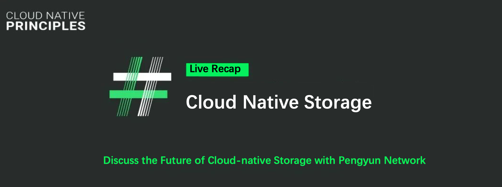
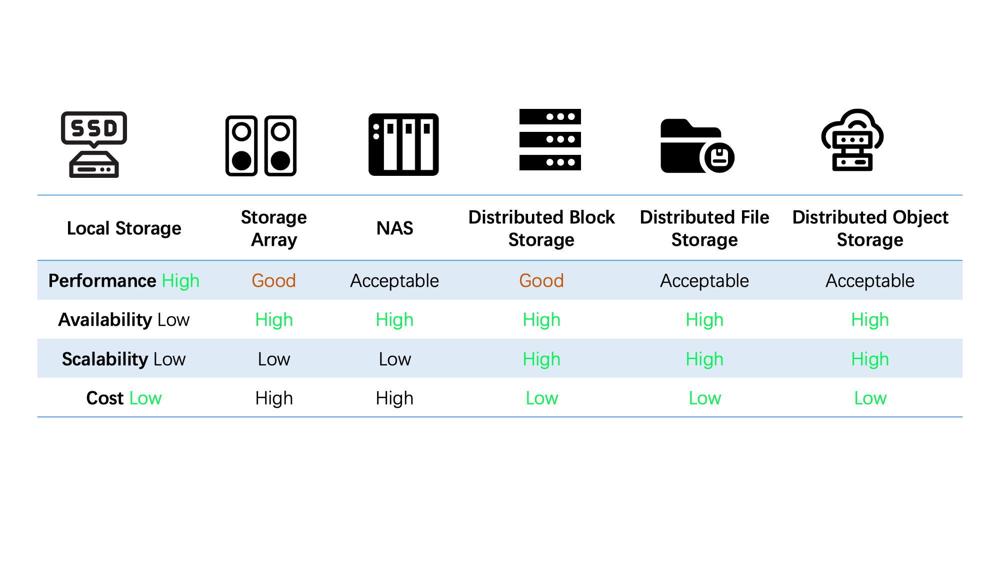
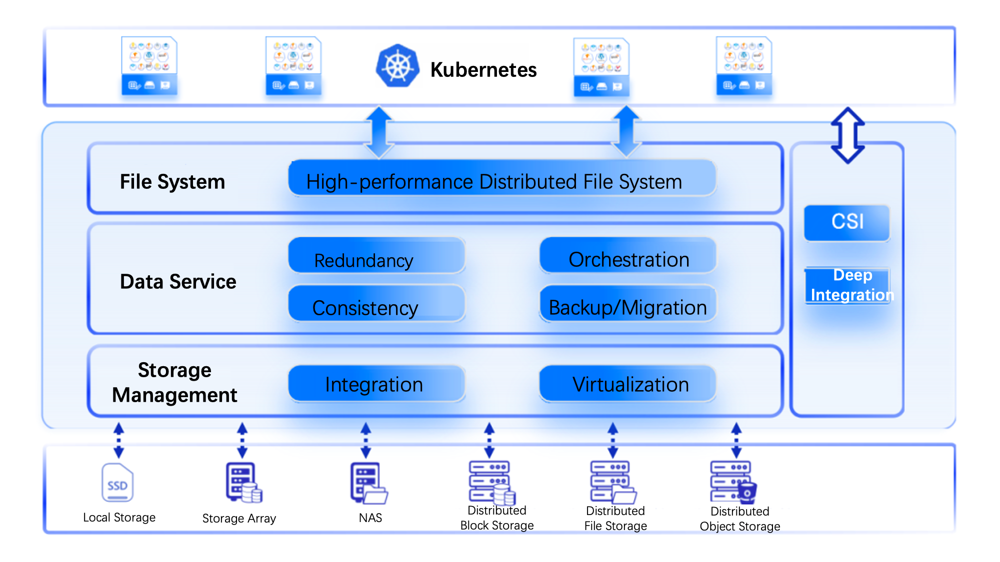

The rapid development of cloud native industry makes many things possible, but it also poses some challenges for application development and operation. As more and more stateful applications are moved onto container platforms, stateful applications have become a major consumer of storage. As a cornerstone for running applications, storage now becomes a major challenge in the process of containerization. In the era of cloud native, what are the new requirements for storage systems? What are the new opportunities and challenges facing cloud-native storage? What are the popular cloud native storage solutions?

On June 20th, 2022, we had a live discussion with [Pengyun Network](https://www.pengyunnetwork.cn/#/Main) on three topics: cloud-native local storage, cloud-native storage solutions for Kubernetes, and the storage systems needed in the era of cloud native.

## HwameiStor

As an infrastructure for containerization in cloud native stack, cloud-native storage exposes underlying storage services to containers and micro-services, and collects storage resources from different media. It can enable stateful workloads to run in containers by providing persistent volumes. CNCF's definition for cloud-native storage has three key points. First, it runs on Kubernetes as a container. Second, it uses Kubernetes object classes, mainly custom resource definition (CRD). Last and the most important, it uses a container storage interface (CSI). HwameiStor is developed based on these three points. it is an end-to-end cloud-native local storage system.

The bottom layer of HwameiStor is a local disk manager (LDM). LDM automatically collects resources from various storage media (such as HDD, SSD and NVMe disks) to form a local storage resource pool for unified automatic management. After HwameiStor is deployed, it can allocate resources on various storage media to different pools. Above the resource pool, it uses logical volume manager (LVM) for management, It also uses the CSI architecture to provide distributed local data volume service, so as to provide data persistence capabilities for cloud-native stateful applications or components.

HwameiStor is a storage system designed for cloud native. It supports high availability, automation, rapid deployment, and high performance with low cost, making it a good alternative to expensive traditional storage area network (SAN). It has three core components:

- Local Disk Management (LDM), which uses CRD to define and manage local data disks. LDM can explicitly get the attributes, size and other information of local disks in Kubernetes.

- Local Storage (LS), which uses LVM to allocate logical volumes (LV) to persistent volumes (PV) after LDM is implemented.

- Scheduler, which schedules containers to nodes with local data.

The core of HwameiStor lies in the definition and implementation of CRDs. On top of  PersistentVolume (PV) and PersistentVolumeClaim (PVC) object classes in Kubernetes, HwameiStor defines a new object class that can associate PV/PVC in Kubernetes with local data disks.

HwameiStor has four features：

- Automatic operation and management: it can automatically discover, identify, manage, and allocate disks, and schedule applications and data according to affinity. It can also automatically monitor disk status and provide timely warning.

- Highly available data support: HwameiStor uses cross-node replicas to synchronize data and achieve high availability. When a node goes wrong, it will automatically schedule applications to highly available data nodes to ensure application continuity.

- Rich types of data volume: HwameiStor aggregates HDD, SSD, and NVMe disks to provide data services with low latency and high throughput.

- Flexible and dynamic linear expansion：HwameiStor can dynamically expand according to cluster size to meet application's requirements for data persistence.

HwameiStor is recommended in the following scenarios:

- Adapt to middlewares with a highly available architecture
  
  Some middlewares, like Kafka, ElasticSearch and Redis, have a highly available architecture and a high requirement for IO data access. The LVM-based single-replica local data volumes provided by HwameiStor are suitable for such kind of applications.

- Provide highly available data volumes for applications

  MySQL and other OLTP databases require their underlying storage systems to provide highly available data storage for quick recovery. Meanwhile, data access should also have a high performance. The highly available dual-replica data volumes with can meet these requirements.

- Provide automatic operation and maintenance for traditional storage software

  MinIO, Ceph and other similar storage software need to use the disks on Kubernetes nodes. HwameiStor's single-replica local volumes can fast respond to the business system's needs for deployment, expansion, and migration, thus realizing automatic operation and maintenance based on Kubernetes. This kind of local volumes can be automatically used by PVC/PV through CSI drives.

## ZettaStor HASP 

According to the CNCF 2020 Annual Report, stateful applications account for 55% of all container applications, making it a mainstream. About 29% stateful applications listed storage as the main challenge for adopting container technology. A storage problem facing cloud native scenarios is that it is difficult to balance performance and availability. Using a single type of storage cannot meet all needs. Therefore, in the actual implementation of stateful applications, data storage technology is the key.

ZettaStor HASP is a cloud-native data aggregation & storage platform. It is also a user-state file system of high performance that supports redundancy protection based on multiple replicas across heterogeneous storage systems. Data replicas can flow between different types of storage systems, which is a big competitiveness over traditional distributed storage systems. In addition, it also supports unified and flexible orchestration of storage resources, and can be tightly integrated with container platforms.

For example:

ZettaStor HASP has a higher data access performance and can realize dynamic allocation and refined management of storage resources. This is desirable for distributed applications that have data redundancy mechanisms themselves and also require high performance, such as Kafka, Redis, MongoDB, and HDFS.

ZettaStor HASP can achieve data high availability based on cross-node redundancy protection, and meanwhile ensure high performance of local storage. This is suitable for applications that have no data redundancy mechanisms and must rely on external storage, such as MySQL, PostgreSQL.

- Critical business should prevent the risk of simultaneous failure of two nodes. ZettaStor HASP's replica redundancy protection across local and external storage systems can ensure smooth running of critical business.

ZettaStor HASP has a three-layer architecture. On the top is a high-performance distributed file system, which is also the core of HASP. This independently-developed file system is fully compatible with POSIX standards and supports zero data copy between user-mode and kernel-mode, giving a full play to the performance of high-speed media, such as NVMe SSD/SCM/PM. In the middle is the data service layer, which can provide services across local storage systems on different nodes, across local storage and external storage systems, and across heterogeneous external storage systems. It can be customized into single replica, multiple replicas, strong consistency, and weak consistency solutions. At the bottom is a storage management layer, which is responsible for interacting with different storage devices. It can break device barriers and connect data islands with unified data format, helping data and business get rid of device limitations. In addition, it can also schedule storage devices through CSI.

ZettaStor HASP is a distributed storage platform closely integrated with container platforms. It supports hyper-converged deployment and CSI integration. It has node affinity, and can sense the running status of user's pods, making storage behavior more adaptable.

## Round Table Discussion

Q1: What is cloud-native storage

[alexzhc](https://github.com/alexzhc): In a narrow sense, cloud-native storage need meet three standards. First, it should meet CSI specification and connect well with CS. Second, it should be deployed on Kubernetes as a container. Third, information in the storage system should create a new object class through CRDs and eventually be stored in Kubernetes.

[fengqinah](https://github.com/fengqinah): Cloud-native storage has multiple features and can meet various demands. In addition to providing a unified storage platform that can offer different storage features for different applications, it should also connect CSI and establish a bridge between storage systems and Kubernetes for communication.

[niulechuan](https://github.com/niulechuan)：The most common cloud-native storage solutions are based on cloud storage or distributed storage. Meanwhile, some service providers are also trying to extend the special capabilities of traditional storage.

Q2: How should cloud-native storage support cloud-native applications

[fengqinah](https://github.com/fengqinah): There are mainly two points. First, cloud-native storage should support features of cloud-native applications, because these features decide the application's requirements for storage. Second, it should meet CSI specifications to support special cloud native requirements.

[niulechuan](https://github.com/niulechuan): From a performance perspective, cloud-native storage needs to meet all requirements of the CSI architecture, so that it can fit diverse cloud-native scenarios. In order to provide good underlying support and response guarantee for cloud-native applications, cloud-native storage needs efficient operation and maintenance. In real cases, cost, portability, and technical support should also be taken into consideration when designing a cloud-native storage solution. Like cloud-native applications, cloud-native storage also requires "elasticity". It should have elastic computing capabilities, scalable data, conversions between cold and hot data. In addition, cloud-native storage should also have an open ecosystem.

Q3: What are the similarities and differences between cloud-native storage and traditional storage? How about their advantages and disadvantages

[alexzhc](https://github.com/alexzhc)：Cloud-native storage is aggregated with Kubernetes after being deployed, while traditional storage is often separated from Kubernetes after being deployed. Cloud-native storage runs on Kubernetes, making it convenient to develop micro-services. If using traditional storage, developers might need to extend the storage API. However, the aggregated form may also, to a certain extent, cause the problem of Kubernetes easily spill over to storage, bringing difficulties to operation and maintenance. Besides, cloud-native storage also has problems about network sharing and disk load.

[fengqinah](https://github.com/fengqinah)：In external storage, storage nodes and computing nodes have a weak mutual impact. Back-end storage is generally distributed, with relatively high security and availability. However, in cloud native scenarios, only using external storage has certain disadvantages. It will increase network consumption, generate additional cost, and lack linkage with Kubernetes.

Q4: How should cloud-native storage empower traditional storage

[niulechuan](https://github.com/niulechuan)：This is a very urgent need. Kubernetes-native capabilities, such as deletion, creation, and expansion, are mainly implemented through CRDs. The community plays an active role in this process. At the same time, some capabilities of traditional storage have not yet been realized in cloud-native storage, such as cron jobs and observability. How to make cloud-native storage better empower traditional storage on platforms, give full play to their advantages, and further advance cloud native storage? This is a long way to go, and our team is working on this.

[alexzhc](https://github.com/alexzhc): To add one more thing. To use a common way to connect Kubernetes and traditional storage, you should aggregate CSI drivers. However, although CSI defines some storage operation flows, it is an interface after all. Therefore, we should consider whether the CSI community should use CRDs to define some features of traditional storage, and whether service providers can define some high-level and special flows by CRDs? We should try to make Kubernetes more applicable in the storage field.
