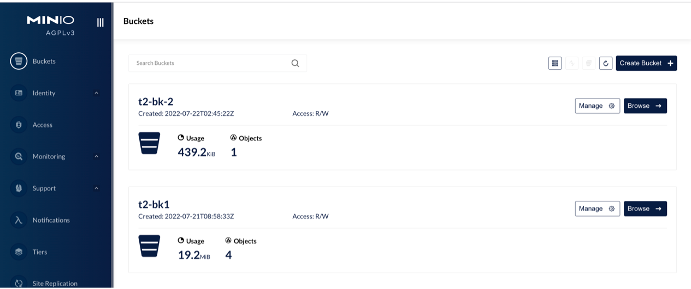
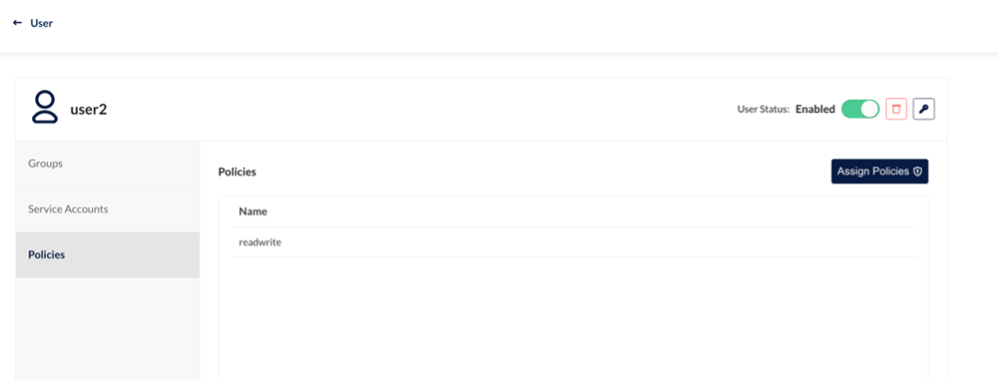

---
slug: minio
title: HwameiStor Supports MinIO
authors: [Simon, Michelle]
tags: [Test]
---

# HwameiStor Supports MinIO

This blog introduces an MinIO storage solution built on HwameiStor, and clarifies the detailed test procedures about whether HwameiStor can properly support those basic features and tenant isolation function provided by MinIO.

## MinIO introduction

MinIO is a high performance object storage solution with native support for Kubernetes deployments.
It can provide distributed, S3-compatible, and multi-cloud storage service in public cloud, private cloud,
and edge computing scenarios. MinIO is a software-defined product and released under [GNU Affero General Public License v3.0](https://www.gnu.org/licenses/agpl-3.0.en.html).
It can also run well on x86 and other standard hardware.


MinIO is designed to meet private cloud's requirements for high performance,
in addition to all required features of object storage.
MinIO features easy to use, cost-effective, and high performance in providing scalable cloud-native object storage services.

MinIO works well in traditional object storage scenarios, such as secondary storage, disaster recovery, and archiving.
It also shows competitive capabilities in machine learning, big data, private cloud, hybrid cloud,
and other emerging fields to well support data analysis, high performance workloads, and cloud-native applications.

### MinIO architecture

MinIO is designed for the cloud-native architecture, so it can be run as a lightweight container
and managed by external orchestration tools like Kubernetes.

The MinIO package comprises of static binary files less than 100 MB.
This small package enables it to efficiently use CPU and memory resources even
with high workloads and can host a large number of tenants on shared hardware.

MinIO's architecture is as follows:


MinIO can run on a standard server that have installed proper local drivers (JBOD/JBOF).
An MinIO cluster has a totally symmetric architecture. In other words,
each server provide same functions, without any name node or metadata server.

MinIO can write both data and metadata as objects, so there is no need to use metadata servers.
MinIO provides erasure coding, bitrot protection, encryption and other features in a strict and consistent way.

Each MinIO cluster is a set of distributed MinIO servers, one MinIO process running on each node.

MinIO runs in a userspace as a single process, and it uses lightweight co-routines for high concurrence.
It divides drivers into erasure sets (generally 16 drivers in each set),
and uses the deterministic hash algorithm to place objects into these erasure sets.

MinIO is specifically designed for large-scale and multi-datacenter cloud storage service.
Tenants can run their own MinIO clusters separately from others, getting rid of interruptions
from upgrade or security problems. Tenants can scale up by connecting multi clusters across geographical regions.


## Build test environment

### Deploy Kubernetes cluster

A Kubernetes cluster was deployed with three virtual machines: one as the master node and two as worker nodes. The kubelet version is 1.22.0.


### Deploy HwameiStor local storage

Deploy HwameiStor local storage on Kubernetes:


Allocate five disks (SDB, SDC, SDD, SDE, and SDF) for each worker node to support HwameiStor local disk management:


Check node status of local storage:


Create storageClass:


## Deploy distributed multi-tenant cluster (minio-operator)

This section will show how to deploy minio-operator, how to create a tenant,
and how to configure HwameiStor local volumes.

### Deploy minio-operator

1. Copy minio-operator repo to your local environment

  ```
  git clone <https://github.com/minio/operator.git>
  ```

  

  

2. Enter helm operator directory `/root/operator/helm/operator`

  

3. Deploy the minio-operator instance

  ```
  helm install minio-operator \
  --namespace minio-operator \
  --create-namespace \
  --generate-name .
  --set persistence.storageClass=local-storage-hdd-lvm .
  ```

4. Check minio-operator running status

  

### Create tenants


1. Enter the `/root/operator/examples/kustomization/base` directory and change `tenant.yaml`

  

2. Enter the `/root/operator/helm/tenant/` directory and change `values.yaml`

  

3. Enter `/root/operator/examples/kustomization/tenant-lite` directory and change `kustomization.yaml`

  

4. Change `tenant.yaml`

  

5. Change `tenantNamePatch.yaml`

  

6. Create a tenant

  ```
  kubectl apply –k . 
  ```

7. Check resource status of the tenant minio-t1

  

8. To create another new tenant, you can first create a new directory `tenant` (in this example `tenant-lite-2`) under `/root/operator/examples/kustomization` and change the files listed above

  

9. Run `kubectl apply –k .` to create the new tenant `minio-t2`

  

### Configure HwameiStor local volumes

Run the following commands in sequence to finish this configuration:

```
kubectl get statefulset.apps/minio-t1-pool-0 -nminio-tenant -oyaml
```


```
kubectl get pvc –A
```


```
kubectl get pvc export-minio6-0 -nminio-6 -oyaml
```


```
kubectl get pv
```


```
kubectl get pvc data0-minio-t1-pool-0-0 -nminio-tenant -oyaml
```


```
kubectl get lv
```


```
kubect get lvr
```


## Test HwameiStor's support for MinIo

With the above settings in place, now let's test basic features and tenant isolation.

### Test basic features


1. Log in to `minio console：10.6.163.52:30401/login`

  

2. Get JWT by `kubectl minio proxy -n minio-operator`

  

3. Browse and manage information about newly-created tenants

  

  

  

  

  

  

4. Log in as tenant minio-t1 (Account: minio)

  

  

5. Browse bucket bk-1

  

  

  

6. Create a new bucket bk-1-1

  

  

  

7. Create path path-1-2

  

  

8. Upload the file

  

  

  

9. Upload the folder

  

  

  

  

10. Create a user with read-only permission

  

  

### Test tenant isolation

1. Log in as tenant minio-t2

  

  

2. Only minio-t2 information is visible. You cannot see information about tenant minio-t1.

  

3. Create bucket

  

  

4. Create path

  

  

5. Upload the file

  

  

6. Create a user

  

  

  

  

  

7. Configure user policies

  

  

8. Delete a bucket

  

  

  

  

  

  

## Conclusion

In this test, we successfully deployed MinIO distributed object storage on the basis of Kubernetes 1.22 and
the HwameiStor local storage. We performed the basic feature test,
system security test, and operation and maintenance management test.

All tests are passed, proving HwameiStor can well support for MinIO.
