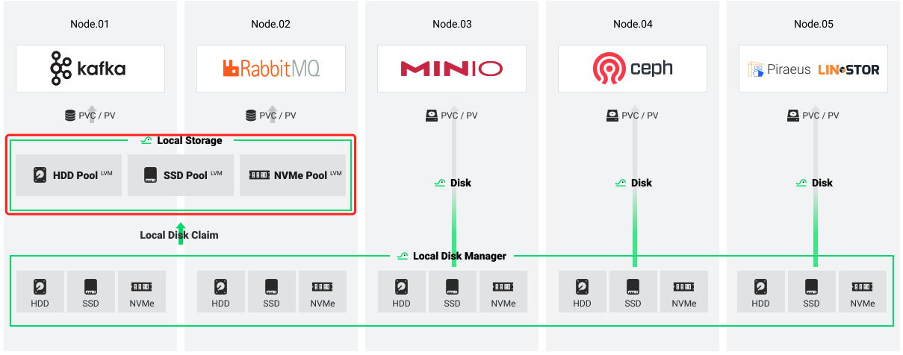

# Local Storage

Local Storage is one of the modules of HwameiStor which is a cloud-native local storage system. It provisions high performance and persistent LVM volume with local access to applications.

Supported volume managers: `LVM`.

Supported storage medium: `HDD`, `SSD`, `NVMe`.

## Applicable scenarios

HwameiStor provisions two kinds of local volumes: LVM and Disk. As a component of HwameiStor, Local Storage provisions two types of local LVM volumes, such as HA and non-HA.

For the non-HA local LVM volume, it's the best solution for data persistency in the following use cases:

- **Databases** with HA capability, such as MongoDB, etc.
- **Messaging systems** with HA capability, such as Kafka, RabbitMQ, etc.
- **Key-value stores** with HA capability, such as Redis, etc.
- Others with HA capability

For the HA local LVM volume, it's the best solution for data persistency in the following use cases:

- **Database**, such as MySQL, PostgreSQL, etc.
- Other applications which require the data with HA features.

## Usage with Helm Chart

Local Storage is a component of HwameiStor and must work with the [Local Disk Manager](./ldm.md) module. It's suggested to [install by helm-charts](../../quick_start/install/deploy.md).

## Usage with Independent Installation

Developer can start using local-storage with [helm chart](../../quick_start/install/deploy.md). This is for dev or test, and will deploy local-storage from the github repo. In this case, you should first install the Local Disk Manager.

## Roadmap

[Roadmap](https://github.com/hwameistor/local-storage/blob/main/doc/roadmap.md) provides a release plan about local storage and its features.
