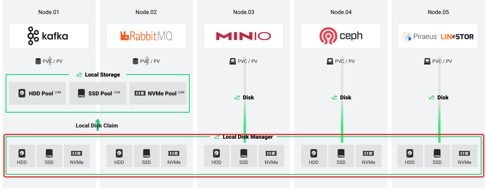

# Local Disk Manager

Local Disk Manager (LDM) is one of the modules of HwameiStor. `LDM` is used to simplify the management of disks on nodes. It can abstract the disk on a node into a resource for monitoring and management purposes. It's a daemon that will be deployed on each node, then detect the disk on the node, abstract it into local disk (LD) resources and save it to kubernetes.



At present, the LDM project is still in the `alpha` stage.

## Concepts

LocalDisk (LD): LDM abstracts disk resources into objects in kubernetes. An `LD` resource object represents the disk resources on the host.

LocalDiskClaim (LDC): This is a way to use disks. A user can add the disk description to select a disk for use.

> At present, LDC supports the following options to describe disk:
>
> - NodeName
> - Capacity
> - DiskType (such as HDD/SSD/NVMe)

## Usage

1. Get the LocalDisk information.

    ```bash
    kubectl get localdisk
    NAME               NODEMATCH        PHASE
    10-6-118-11-sda    10-6-118-11      Available
    10-6-118-11-sdb    10-6-118-11      Available
    ```

    Get locally discovered disk resource information with three columns displayed.

    - **NAME:** represents how this disk is displayed in the cluster resources.
    - **NODEMATCH:** indicates which host this disk is on.
    - **PHASE:** represents the current state of the disk.

    Use `kubectl get localdisk <name> -o yaml` to view more information about disks.

2. Claim available disks.

    1. Apply a LocalDiskClaim.

       ```bash
       cat << EOF | kubectl apply -f -
       apiVersion: hwameistor.io/v1alpha1
       kind: LocalDiskClaim
       metadata:
         name: <localDiskClaimName>
       spec:
         description:
           # e.g. HDD,SSD,NVMe
           diskType: <diskType>
         # the node where disks attached
         nodeName: <nodeName>
         # the owner of the allocated disks e.g. local-storage,local-disk-manager
         owner: <ownerName>
       EOF
       ```

        Allocate available disks by issuing a disk usage request. In the request description, you can add more requirements about the disk, such as disk type and capacity.

    2. Get the LocalDiskClaim information.

        ```bash
        kubectl get localdiskclaim <name>
        ```
    3. Once the LDC is processed successfully, it will be cleanup by the system automatically. The result will be recorded in the `LocalStorageNode` if the owner is `local-storage`.
