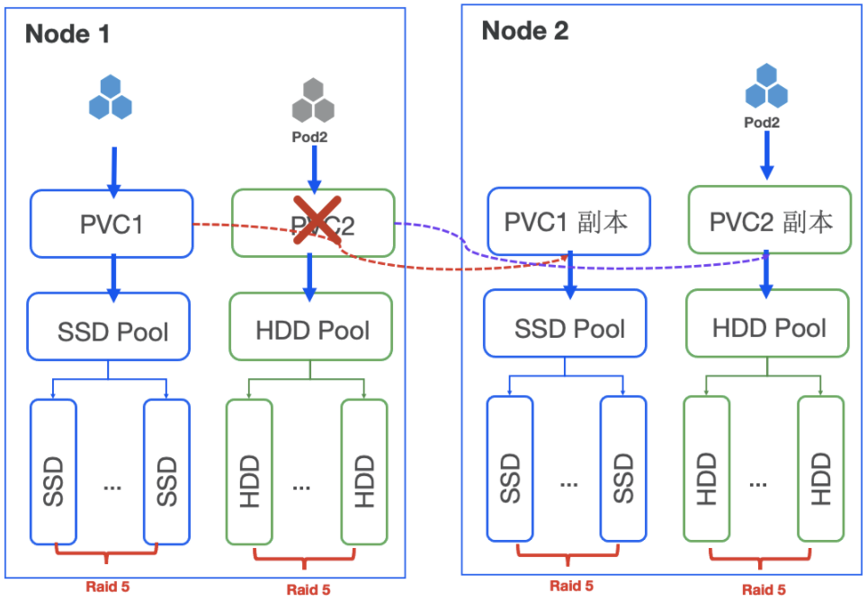

# Overview

HwameiStor provisions two kind of local volumes: LVM and Disk.

As a component of HwameiStor, Local Storage provisions two types of local LVM volumes, such as HA and non-HA.

For the non-HA local LVM volume, it's the best solution for data persistency in the following use cases:

- **Database** with HA capability, such as MongoDB, etc.
- **Messaging system** with HA capability, such as Kafka, RabbitMQ, etc.
- **Key-value store** with HA capability, such as Redis, etc.
- Others with HA capability

For the HA local LVM volume, it's the best solution for data persistency in the following use cases:

- **Database**, such as MySQL, PostgreSQL, etc.
- Other applications which requires the data with HA features.

## Hot backup

### Intra-node hot backup

It guarantees with raid 5, which can tolerate a set of disk failures.

Control flow is independent of data flow to ensure the stability of data access.

### Inter-node hot backup
It provides protection with raid 5 + active/standby mechanism.

The dce-storage, a dedicated network logical interface for HA, is designed to synchronize storage traffic between nodes. It can synchronously replicate data across nodes to guarantee a hot backup of data.

## Rebalance data

Balanced placement of data in the cluster is achieved through data volume migration technology. Move data online to nodes with more storage space.

## Change volume type

In order to support some special scenarios, a single-replica volume is allowed to be changed to multiple replicas, and inter-node hot backup is supported.

