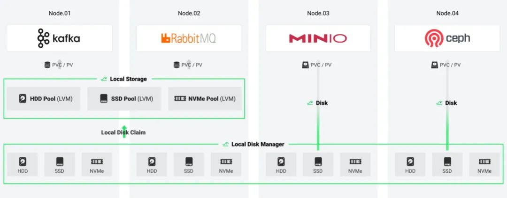

> 今日播报：
> 独属于程序员们的、自由演化的 “元宇宙” 新土地 — HwameiStor 云原生本地存储系统，等您来开垦。

**「DaoCloud  道客」正式开源「云原生本地储存系统HwameiStor」**。HwameiStor 将 HDD、SSD 和 NVMe 磁盘形成本地存储资源池进行统一管理，使用 CSI 架构提供分布式的本地数据卷服务，为有状态的云原生应用或组件提供数据持久化能力，**欢迎广大技术开发者和爱好者前去试用**。

在云原生时代， 应用开发者可以专注于业务逻辑本身，而应用运行时所需的敏捷性、扩展性、可靠性等，则下沉到基础设施软件和运维团队。**HwameiStor 正是满足云原生时代要求的储存系统。 它具有高可用、自动化、低成本、快速部署、高性能等优点，可以替代昂贵的传统 SAN 存储**。

## 智、稳、敏 全面增强本地存储

- 自动化运维管理

  可以自动发现、识别、管理、分配磁盘。 根据亲和性，智能调度应用和数据。自动监测磁盘状态，并及时预警。

- 高可用的数据

  使用跨节点副本同步数据， 实现高可用。发生问题时，会自动将应用调度到高可用数据节点上，保证应用的连续性。

- 丰富的数据卷类型

  聚合 HDD、SSD、NVMe 类型的磁盘，提供非低延时，高吞吐的数据服务。

- 灵活动态的线性扩展

  可以根据集群规模大小进行动态的扩容，灵活满足应用的数据持久化需求。

## 丰富应用场景 广泛适配企业需求

- 适配高可用架构中间件

  Kafka、ElasticSearch、Redis等，这类中间件应用自身具备高可用架构，同时对数据的 IO 访问有很高要求。HwameiStor 提供的基于 LVM 的单副本本地数据卷，可以很好地满足它们的要求。

- 为应用提供高可用数据卷

  MySQL 等 OLTP 数据库，要求底层存储提供高可用的数据存储，当发生问题时可快速恢复数据，同时，也要求保证高性能的数据访问。HwameiStor 提供的双副本的高可用数据卷，可以很好地满足此类需求。

- 自动化运维传统存储软件

  MinIO、Ceph 等存储软件，需要使用 Kubernetes 节点上的磁盘，可以采用 PVC/PV 的方式，通过 CSI 驱动自动化地使用 HwameiStor 的单副本本地卷，快速响应业务系统提出的部署、扩容、迁移等需求，实现基于 Kubernetes 的自动化运维。

## 加入我们

如果说未来是智能互联时代，那么程序员就是通往未来的领路人，开源社区就是程序员们的 “元宇宙”。

目前，「HwameiStor 云原生本地储存系统」已经正式在 Github 开源上线，对它感兴趣的话，就来加入我们吧，一起开垦这块属于程序员的 “元宇宙” 新土地，成为未来行道者。

