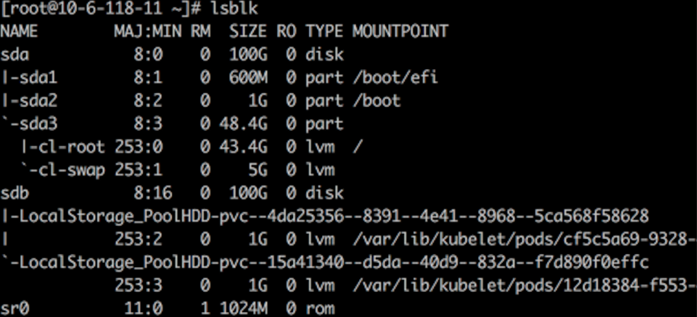
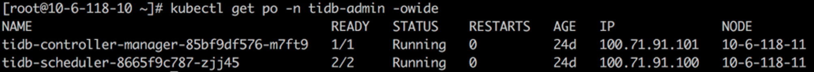
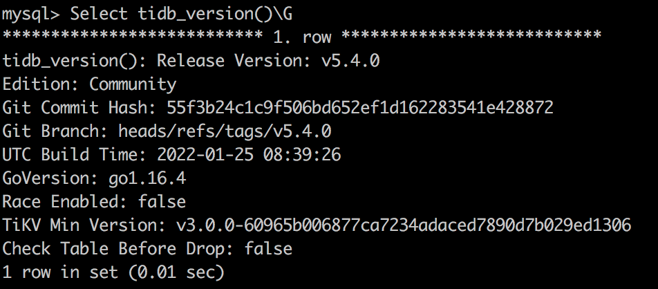
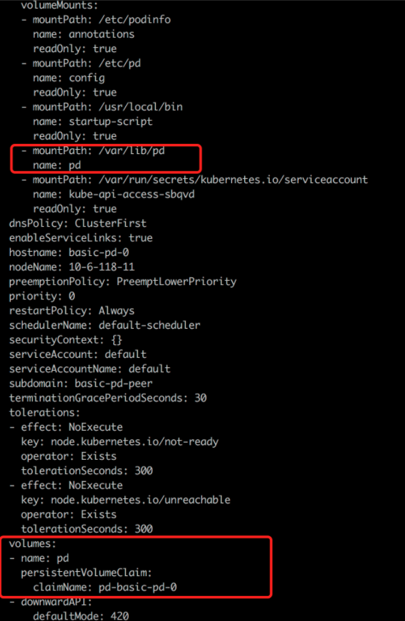

本次测试环境为 Kubernetes 1.22，对接 HwameiStor 本地存储后，成功部署 TiDB 1.3，随后执行数据库 SQL 基本能力测试、系统安全测试及运维管理测试。

全部测试成功通过，证实 HwameiStor 能够完美支撑 TiDB 这类高可用、强一致要求较高、数据规模较大的分布式数据库应用场景。

## TiDB 简介

TiDB 是一款同时支持在线事务处理 (OLTP) 与在线分析处理 (OATP) 的融合型分布式数据库产品，具备水平扩缩容、金融级高可用、实时 HTAP（即同时支持 OLTP 和 OATP）、云原生的分布式数据库，兼容 MySQL 5.7 协议和 MySQL 生态等重要特性。TiDB 的目标是为用户提供一站式的 OLTP、OLAP、HTAP 解决方案，适合高可用、强一致要求较高、数据规模较大等各种应用场景。

### TiDB 整体架构

TiDB 分布式数据库将整体架构拆分成了多个模块，各模块之间互相通信，组成完整的 TiDB 系统。对应的架构图如下：


- **TiDB Server**
  
  SQL 层对外暴露 MySQL 协议的连接端点，负责接受客户端的连接，执行 SQL 解析和优化，最终生成分布式执行计划。TiDB 层本身是无状态的，实践中可以启动多个 TiDB 实例，通过负载均衡组件（如 LVS、HAProxy 或 F5）对外提供统一的接入地址，客户端的连接可以均匀地分摊在多个 TiDB 实例上以达到负载均衡的效果。TiDB Server 本身并不存储数据，只是解析 SQL，将实际的数据读取请求转发给底层的存储节点 TiKV（或 TiFlash）。

- **PD (Placement Driver) Server**
  
  整个 TiDB 集群的元信息管理模块，负责存储每个 TiKV 节点实时的数据分布情况和集群的整体拓扑结构，提供 TiDB Dashboard 管控界面，并为分布式事务分配事务 ID。PD 不仅存储元信息，同时还会根据 TiKV 节点实时上报的数据分布状态，下发数据调度命令给具体的 TiKV 节点，可以说是整个集群的“大脑”。此外，PD 本身也是由至少 3 个节点构成，拥有高可用的能力。建议部署奇数个 PD 节点。

- **存储节点**
	
	- TiKV Server：负责存储数据，从外部看 TiKV 是一个分布式的提供事务的 Key-Value 存储引擎。存储数据的基本单位是 Region，每个 Region 负责存储一个 Key Range（从 StartKey 到 EndKey 的左闭右开区间）的数据，每个 TiKV 节点会负责多个 Region。TiKV 的 API 在 KV 键值对层面提供对分布式事务的原生支持，默认提供了 SI (Snapshot Isolation) 的隔离级别，这也是 TiDB 在 SQL 层面支持分布式事务的核心。TiDB 的 SQL 层做完 SQL 解析后，会将 SQL 的执行计划转换为对 TiKV API 的实际调用。所以，数据都存储在 TiKV 中。另外，TiKV 中的数据都会自动维护多副本（默认为三副本），天然支持高可用和自动故障转移。

	- TiFlash：TiFlash 是一类特殊的存储节点。和普通 TiKV 节点不一样的是，在 TiFlash 内部，数据是以列式的形式进行存储，主要的功能是为分析型的场景加速。

### TiDB 数据库的存储


- **键值对 (Key-Value Pair)**

  TiKV 的选择是 Key-Value 模型，并且提供有序遍历方法。TiKV 数据存储的两个关键点：

  - 这是一个巨大的 Map（可以类比一下 C++ 的 std::map），也就是存储的是 Key-Value Pairs。

  - 这个 Map 中的 Key-Value pair 按照 Key 的二进制顺序有序，也就是可以 Seek 到某一个 Key 的位置，然后不断地调用 Next 方法以递增的顺序获取比这个 Key 大的 Key-Value。

- **本地存储（Rocks DB）**
  
  任何持久化的存储引擎，数据终归要保存在磁盘上，TiKV 也不例外。但是 TiKV 没有选择直接向磁盘上写数据，而是把数据保存在 RocksDB 中，具体的数据落地由 RocksDB 负责。这样做的原因是开发一个单机存储引擎工作量很大，特别是要做一个高性能的单机引擎，需要做各种细致的优化，而 RocksDB 是由 Facebook 开源的一个非常优秀的单机 KV 存储引擎，可以满足 TiKV 对单机引擎的各种要求。这里可以简单地认为 RocksDB 是一个单机的持久化 Key-Value Map。

- **Raft 协议**
  
  TiKV 选择了 Raft 算法来保证单机失效的情况下数据不丢失不出错。简单来说，就是把数据复制到多台机器上，这样某一台机器无法提供服务时，其他机器上的副本还能提供服务。这个数据复制方案可靠并且高效，能处理副本失效的情况。

- **Region**
  
  TiKV 选择了按照 Key 划分 Range。某一段连续的 Key 都保存在一个存储节点上。将整个 Key-Value 空间分成很多段，每一段是一系列连续的 Key，称为一个 Region。尽量让每个 Region 中保存的数据不超过一定的大小，目前在 TiKV 中默认是不超过 96MB。每一个 Region 都可以用 [StartKey，EndKey] 这样的左闭右开区间来描述。

- **MVCC**
  
  TiKV实现了多版本并发控制 (MVCC)。

- **分布式 ACID 事务**
  
  TiKV 的事务采用的是 Google 在 BigTable 中使用的事务模型：Percolator。

## 搭建测试环境

### Kubernetes 集群

本次测试使用三台虚拟机节点部署 Kubernetes 集群，包括 1 个 master 节点和 2 个 worker节点。Kubelete 版本为 1.22.0。


### HwameiStor 本地存储

1. 在 Kubernetes 集群上部署 HwameiStor 本地存储

   

2. 在两台 worker 节点上分别为 HwameiStor 配置一块 100G 的本地磁盘 sdb

   

   

3. 创建 storagClass

   

### 在 Kubernetes 上部署 TiDB

可以使用 TiDB Operator 在 Kubernetes 上部署 TiDB。TiDB Operator 是 Kubernetes 上的 TiDB 集群自动运维系统，提供包括部署、升级、扩缩容、备份恢复、配置变更的 TiDB 全生命周期管理。借助 TiDB Operator，TiDB 可以无缝运行在公有云或私有部署的 Kubernetes 集群上。

TiDB 与 TiDB Operator 版本的对应关系如下：

| TiDB  版本         | 适用的 TiDB Operator 版本 |
| ------------------ | ------------------------- |
| dev                | dev                       |
| TiDB  >= 5.4       | 1.3                       |
| 5.1  <= TiDB < 5.4 | 1.3（推荐），1.2          |
| 3.0  <= TiDB < 5.1 | 1.3（推荐），1.2，1.1     |
| 2.1  <= TiDB < 3.0 | 1.0（停止维护）           |

#### 部署 TiDB Operator

1. 安装 TiDB CRDs

   ```bash
   kubectl apply -f https://raw.githubusercontent.com/pingcap/tidb-operator/master/manifests/crd.yaml
   ```

2. 安装 TiDB Operator

   ```bash
   helm repo add pingcap https://charts.pingcap.org/ 
   kubectl create namespace tidb-admin 
   helm install --namespace tidb-admin tidb-operator pingcap/tidb-operator --version v1.3.2 \
   --set operatorImage=registry.cn-beijing.aliyuncs.com/tidb/tidb-operator:v1.3.2 \
   --set tidbBackupManagerImage=registry.cn-beijing.aliyuncs.com/tidb/tidb-backup-manager:v1.3.2 \
   --set scheduler.kubeSchedulerImageName=registry.cn-hangzhou.aliyuncs.com/google_containers/kube-scheduler
   ```

3. 检查 TiDB Operator 组件

   

#### 部署 TiDB 集群

```bash
kubectl create namespace tidb-cluster && \
kubectl -n tidb-cluster apply -f https://raw.githubusercontent.com/pingcap/tidb-operator/master/examples/basic/tidb-cluster.yaml 
kubectl -n tidb-cluster apply -f https://raw.githubusercontent.com /pingcap/tidb-operator/master/examples/basic/tidb-monitor.yaml
```


#### 连接 TiDB 集群

```bash
yum -y install mysql-client
```


```bash
kubectl port-forward -n tidb-cluster svc/basic-tidb 4000 > pf4000.out & 
```


#### 检查并验证 TiDB 集群状态

1. 创建 Hello_world 表

   ```sql
   create table hello_world (id int unsigned not null auto_increment primary key, v varchar(32)); 
   ```
   

2. 查询 TiDB 版本号

   ```
   select tidb_version()\G;
   ```
   

3. 查询 Tikv 存储状态

   ```sql
   select * from information_schema.tikv_store_status\G;
   ```
   

#### HwameiStor 存储配置

从 `storageClass local-storage-hdd-lvm` 分别为 tidb-tikv 及 tidb-pd 创建一个 PVC:


```bash
kubectl get po basic-tikv-0 -oyaml
```


```bash
kubectl get po basic-pd-0 -oyaml
```



## 测试内容

### 数据库 SQL 基本能力测试

完成部署数据库集群后，执行了以下基本能力测试，全部通过。

#### 分布式事务

测试目的：支持在多种隔离级别下，实现分布式数据操作的完整性约束即 ACID属性

测试步骤：

1.	创建测试数据库 CREATE DATABASE testdb

2.	创建测试用表 CREATE TABLE `t_test ( id int AUTO_INCREMENT, name varchar(32), PRIMARY KEY (id) )`

3.	运行测试脚本

测试结果：支持在多种隔离级别下，实现分布式数据操作的完整性约束即 ACID 属性

#### 对象隔离

测试目的：测试不同 schema 实现对象隔离

测试脚本：

```sql
create database if not exists testdb;
use testdb
create table if not exists t_test
( id                   bigint,
  name                 varchar(200),
  sale_time            datetime default current_timestamp,
  constraint pk_t_test primary key (id)
);
insert into t_test(id,name) values (1,'a'),(2,'b'),(3,'c');
create user 'readonly'@'%' identified by "readonly";
grant select on testdb.* to readonly@'%';
select * from testdb.t_test;
update testdb.t_test set name='aaa';
create user 'otheruser'@'%' identified by "otheruser";
```

测试结果：支持创建不同 schema 实现对象隔离

#### 表操作支持

测试目的：测试是否支持创建、删除和修改表数据、DML、列、分区表

测试步骤：连接数据库后按步骤执行测试脚本

测试脚本：

```sql
# 创建和删除表
drop table if exists t_test;
create table if not exists t_test
( id                   bigint default '0',
  name                 varchar(200) default '' ,
  sale_time            datetime default current_timestamp,
  constraint pk_t_test primary key (id)
);
# 删除和修改
insert into t_test(id,name) values (1,'a'),(2,'b'),(3,'c'),(4,'d'),(5,'e');
update t_test set name='aaa' where id=1;
update t_test set name='bbb' where id=2;
delete from t_dml where id=5;
# 修改、增加、删除列
alter table t_test modify column name varchar(250);
alter table t_test add column col varchar(255);
insert into t_test(id,name,col) values(10,'test','new_col');     
alter table t_test add column colwithdefault varchar(255) default 'aaaa';
insert into t_test(id,name) values(20,'testdefault');
insert into t_test(id,name,colwithdefault ) values(10,'test','non-default ');     
alter table t_test drop column colwithdefault;
# 分区表类型（仅摘录部分脚本）
CREATE TABLE employees (
    id INT NOT NULL,
fname VARCHAR(30),
lname VARCHAR(30),
    hired DATE NOT NULL DEFAULT '1970-01-01',
    separated DATE NOT NULL DEFAULT '9999-12-31',
job_code INT NOT NULL,
store_id INT NOT NULL
)
```

测试结果：支持创建、删除和修改表数据、DML、列、分区表

#### 索引支持

测试目的：验证多种类型的索引（唯一、聚簇、分区、Bidirectional indexes、Expression-based indexes、哈希索引等等）以及索引重建操作。

测试脚本：

```sql
alter table t_test add unique index udx_t_test (name);
# 默认就是主键聚簇索引
ADMIN CHECK TABLE t_test;
create index time_idx on t_test(sale_time);
alter table t_test drop index time_idx;
admin show ddl jobs;
admin show ddl job queries 156;
create index time_idx on t_test(sale_time);
```

测试结果：支持创建、删除、组合、单列、唯一索引

#### 表达式

测试目的：验证分布式数据库的表达式支持 if、casewhen、forloop、whileloop、loop exit when 等语句（上限 5 类）

前提条件：数据库集群已经部署完成。

测试脚本：

```sql
SELECT CASE id WHEN 1 THEN 'first' WHEN 2 THEN 'second' ELSE 'OTHERS' END AS id_new  FROM t_test;
SELECT IF(id>2,'int2+','int2-') from t_test;
```

测试结果：支持 if、case when、for loop、while loop、loop exit when 等语句（上限 5 类）

#### 执行计划解析

测试目的：验证分布式数据库的执行计划解析支持

前提条件：数据库集群已经部署完成。

测试脚本：

```sql
explain analyze select * from t_test where id NOT IN (1,2,4);
explain analyze select * from t_test a where EXISTS (select * from t_test b where a.id=b.id and b.id<3);
explain analyze SELECT IF(id>2,'int2+','int2-') from t_test;
```

测试结果：支持执行计划的解析

#### 执行计划绑定

测试目的：验证分布式数据库的执行计划绑定功能

测试步骤：

1. 查看 sql 语句的当前执行计划

2. 使用绑定特性

3. 查看该 sql 语句绑定后的执行计划

4. 删除绑定

测试脚本：

```sql
explain select * from employees3 a join employees4 b on a.id = b.id where a.lname='Johnson';
explain select /*+ hash_join(a,b) */ * from employees3 a join employees4 b on a.id = b.id where a.lname='Johnson';
```

测试结果：没有使用 hint 时可能不是 hash_join，使用 hint 后一定是 hash_join。

#### 常用函数

测试目的：验证分布式数据库的标准的数据库函数(支持的函数类型）

测试结果：支持标准的数据库函数

#### 显式/隐式事务

测试目的：验证分布式数据库的事务支持

测试结果：支持显示与隐式事务

#### 字符集

测试目的：验证分布式数据库的数据类型支持

测试结果：目前只支持 UTF-8 mb4 字符集

#### 锁支持

测试目的：验证分布式数据库的锁实现

测试结果：描述了锁的实现方式，R-R/R-W/W-W 情况下阻塞情况，死锁处理方式

#### 隔离级别

测试目的：验证分布式数据库的事务隔离级别

测试结果：支持 si 隔离级别，支持 rc 隔离级别（4.0 GA 版本）

#### 分布式复杂查询

测试目的：验证分布式数据库的分布式复杂查询能力

测试结果：支持跨节点 join 等分布式复杂查询、操作等，支持窗口函数、层次查询

### 系统安全测试

这部分测试系统安全，完成数据库集群部署后，以下安全测试全部通过。

#### 账号管理与权限测试

测试目的：验证分布式数据库的账号权限管理

测试脚本：

```sql
select host,user,authentication_string from mysql.user;
create user tidb IDENTIFIED by 'tidb'; 
select host,user,authentication_string from mysql.user;
set password for tidb =password('tidbnew');
select host,user,authentication_string,Select_priv from mysql.user;
grant select on *.* to tidb;
flush privileges ;
select host,user,authentication_string,Select_priv from mysql.user;
grant all privileges on *.* to tidb;
flush privileges ;
select * from  mysql.user where user='tidb';
revoke select on *.* from tidb; 
flush privileges ;
revoke all privileges on *.* from tidb;
flush privileges ;
grant select(id) on test.TEST_HOTSPOT to tidb;
drop user tidb;
```

测试结果：

- 支持创建、修改删除账号，并配置和密码，支持安全、审计和数据管理三权分立

- 根据不同账号，对数库各个级别权限控制包括：实例/库/表/列级别

#### 访问控制

测试目的：验证分布式数据库的权限访问控制，数据库数据通过赋予基本增删改查访问权限控制

测试脚本：

```sql
mysql -u root -h 172.17.49.222 -P 4000
drop user tidb;
drop user tidb1;
create user tidb IDENTIFIED by 'tidb'; 
grant select on tidb.* to tidb;
grant insert on tidb.* to tidb;
grant update on tidb.* to tidb;
grant delete on tidb.* to tidb;
flush privileges;
show grants for tidb;
exit;
mysql -u tidb -h 172.17.49.222 -ptidb -P 4000 -D tidb -e 'select * from aa;'
mysql -u tidb -h 172.17.49.222 -ptidb -P 4000 -D tidb -e 'insert into aa values(2);'
mysql -u tidb -h 172.17.49.222 -ptidb -P 4000 -D tidb -e 'update aa set id=3;'
mysql -u tidb -h 172.17.49.222 -ptidb -P 4000 -D tidb -e 'delete from aa where id=3;'
```

测试结果：数据库数据通过赋予基本增删改查访问权限控制。

#### 白名单

测试目的：验证分布式数据库的白名单功能

测试脚本：

```sql
mysql -u root -h 172.17.49.102 -P 4000
drop user tidb;
create user tidb@'127.0.0.1' IDENTIFIED by 'tidb'; 
flush privileges;
select * from mysql.user where user='tidb';
mysql -u tidb -h 127.0.0.1 -P 4000 -ptidb
mysql -u tidb -h 172.17.49.102 -P 4000 -ptidb
```

测试结果：支持 IP 白名单功能，支持 IP 段通配操作

#### 操作日志记录

测试目的：验证分布式数据库的操作监控能力

测试脚本：`kubectl -ntidb-cluster logs tidb-test-pd-2 --tail 22`

测试结果：记录用户通过运维管理控制台或者 API 执行的关键操作或者错误操作

### 运维管理测试

这部分测试系统运维，完成数据库集群部署后，以下运维管理测试全部通过。

#### 数据导入导出

测试目的：验证分布式数据库的数据导入导出的工具支持

测试脚本：

```sql
select * from sbtest1 into outfile '/sbtest1.csv';
load data local infile '/sbtest1.csv' into table test100;
```

测试结果：支持按表、schema、database 级别的逻辑导出导入

#### 慢日志查询

测试目的：获取慢查询的 SQL 信息

前提条件：SQL 执行时间需大于配置的慢查询记录阈值,且 SQL 执行完毕

测试步骤：

1. 调整慢查询阈值到 100ms

2. 执行 sql

3. 查看 log/系统表/dashboard 中的慢查询信息

测试脚本：

```sql
show variables like 'tidb_slow_log_threshold';
set tidb_slow_log_threshold=100;
select query_time, query from information_schema.slow_query where is_internal = false order by query_time desc limit 3;
```

测试结果：可以获取慢查询信息

> 有关测试详情，请查阅 [TiDB on hwameiStor 部署及测试记录](file/TiDBonHwameiStor.docx)。
