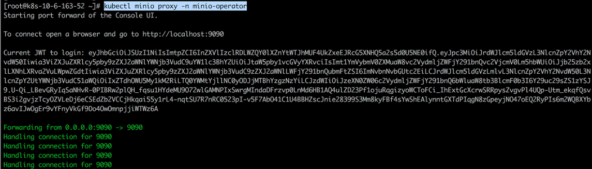
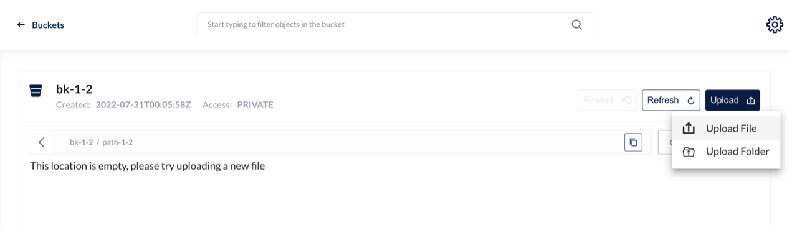

---
slug: minio
title: HwameiStor 对 Minio 的支持
authors: [Simon]
tags: [Test]
---

## MinIO 简介

MinIO 是一款高性能、分布式、兼容 S3 的多云对象存储系统套件。MinIO 原生支持 Kubernetes，能够支持所有公有云、私有云及边缘计算环境。
MinIO 是 GNU AGPL v3 开源的软件定义产品，能够很好地运行在标准硬件如 X86 等设备上。


MinIO 的架构设计从一开始就是针对性能要求很高的私有云标准，在实现对象存储所需要的全部功能的基础上追求极致的性能。
MinIO 具备易用性、高效性及高性能，能够以更简单的方式提供具有弹性伸缩能力的云原生对象存储服务。

MinIO 在传统对象存储场景（如辅助存储、灾难恢复和归档）方面表现出色，同时在机器学习、大数据、私有云、混合云等方面的存储技术上也独树一帜，包括数据分析、高性能应用负载、原生云应用等。

### MinIO 架构设计

MinIO 为云原生架构设计，可以作为轻量级容器运行，并由外部编排服务（如 Kubernetes）进行管理。
MinIO 整个服务包约为不到 100 MB 的静态二进制文件，即使在很高负载下也可以高效利用 CPU 和内存资源并可以在共享硬件上共同托管大量租户。
对应的架构图如下：


MinIO 可以在带有本地驱动器（JBOD/JBOF）的标准服务器上运行。
集群为完全对称的体系架构，即所有服务器的功能均相同，没有名称节点或元数据服务器。

MinIO 将数据和元数据作为对象一起写入从而无需使用元数据数据库。
MinIO 以内联、严格一致的操作执行所有功能，包括擦除代码、位 rotrot 检查、加密等。

每个 MinIO 集群都是分布式 MinIO 服务器的集合，每个节点一个进程。
MinIO 作为单个进程在用户空间中运行，并使用轻量级的协同例程来实现高并发。
将驱动器分组到擦除集（默认情况下，每组 16 个驱动器），然后使用确定性哈希算法将对象放置在这些擦除集上。

MinIO 专为大规模、多数据中心云存储服务而设计。
每个租户都运行自己的 MinIO 集群，该集群与其他租户完全隔离，从而使租户能够免受升级、更新和安全事件的任何干扰。
每个租户通过联合跨地理区域的集群来独立扩展。


## 测试环境

### 部署 Kubernetes 集群

本次测试使用了三台虚拟机节点部署了 Kubernetes 集群：1 Master + 2 Worker 节点，kubelet 版本为 1.22.0。


### 部署 HwameiStor 本地存储

在 Kubernetes 上部署 HwameiStor 本地存储。


两台 Worker 节点各配置了五块磁盘（SDB、SDC、SDD、SDE、SDF）用于 HwameiStor 本地磁盘管理。


查看 local storage node 状态。


创建了 storagClass。


## 分布式多租户源码部署安装（minio operator）

本节说明如何部署 minio operator，如何创建租户，如何配置 HwameiStor 本地卷。

### 部署 minio operator

参照以下步骤部署 minio operator。

1. 复制 minio operator 仓库到本地。

  ```
  git clone <https://github.com/minio/operator.git>
  ```

  

  

2. 进入 helm operator 目录：`/root/operator/helm/operator`。

  

3. 部署 minio-operator 实例。

  ```
  helm install minio-operator \
  --namespace minio-operator \
  --create-namespace \
  --generate-name .
  --set persistence.storageClass=local-storage-hdd-lvm .
  ```

4. 检查 minio-operator 资源运行情况。

  

### 创建租户

参照以下步骤创建一个租户。

1. 进入 `/root/operator/examples/kustomization/base` 目录。如下修改 tenant.yaml。

  

2. 进入 `/root/operator/helm/tenant/` 目录。如下修改 `values.yaml` 文件。

  

3. 进入 `/root/operator/examples/kustomization/tenant-lite` 目录。如下修改 `kustomization.yaml` 文件。

  

4. 如下修改 `tenant.yaml` 文件。

  

5. 如下修改 `tenantNamePatch.yaml` 文件。

  

6. 创建租户：

  ```
  kubectl apply –k . 
  ```

7. 检查租户 minio-t1 资源状态：

  

8. 如要创建一个新的租户可以在 `/root/operator/examples/kustomization` 目录下建一个新的 `tenant` 目录（本案例为 `tenant-lite-2`）并对相应文件做对应修改。

  

9. 执行 `kubectl apply –k .` 创建新的租户 `minio-t2`。

  

### 配置 HwameiStor 本地卷

依次运行以下命令来配置本地卷。

```
kubectl get statefulset.apps/minio-t1-pool-0 -nminio-tenant -oyaml
```


```
kubectl get pvc –A
```


```
kubectl get pvc export-minio6-0 -nminio-6 -oyaml
```


```
kubectl get pv
```


```
kubectl get pvc data0-minio-t1-pool-0-0 -nminio-tenant -oyaml
```


```
kubectl get lv
```


```
kubect get lvr
```


## HwameiStor 与 MinIo 测试验证

完成上述配置之后，执行了基本功能测试和多租户隔离测试。

### 基本功能测试

基本功能测试的步骤如下。

1. 从浏览器登录 `minio console：10.6.163.52:30401/login`。

  

2. 通过 `kubectl minio proxy -n minio-operator `获取 JWT。

  

3. 浏览及管理创建的租户信息。

  

  

  

  

  

  

4. 登录 minio-t1 租户（用户名 minio，密码 minio123）。

  

  

5. 浏览 bucket bk-1。

  

  

  

6. 创建新的 bucket bk-1-1。

  

  

  

7. 创建 path path-1-2。

  

  

8. 上传文件成功：

  

  

  

9. 上传文件夹成功：

  

  

  

  

10. 创建只读用户：

  

  

### 多租户隔离测试

执行以下步骤进行多租户隔离测试。

1. 登录 minio-t2 租户。

  

  

2. 此时只能看到 minio-t2 内容，minio-t1 的内容被屏蔽。

  

3. 创建 bucket。

  

  

4. 创建 path。

  

  

5. 上传文件。

  

  

6. 创建用户。

  

  

  

  

  

7. 配置用户 policy。

  

  

8. 删除 bucket。

  

  

  

  

  

  

## 结论

本次测试是在 kubernetes 1.22 平台上部署了 minio 分布式对象存储并对接 HwameiStor 本地存储。在此环境中完成了基本能力测试，系统安全测试及运维管理测试。

全部测试成功通过。
