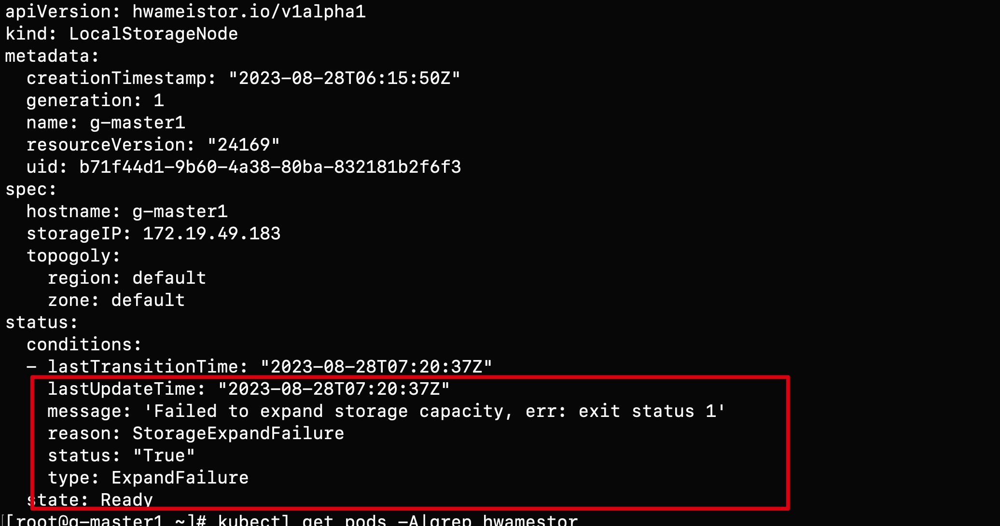

# 常见问题

## Q1：HwameiStor 本地存储调度器 scheduler 在 Kubernetes 平台中是如何工作的？

HwameiStor 的调度器是以 Pod 的形式部署在 HwameiStor 的命名空间。


当应用（Deployment 或 StatefulSet）被创建后，应用的 Pod 会被自动部署到已配置好具备 HwameiStor 本地存储能力的 Worker 节点上。

## Q2: HwameiStor 如何应对应用多副本工作负载的调度？与传统通用型共享存储有什么不同？

HwameiStor 建议使用有状态的 StatefulSet 用于多副本的工作负载。

有状态应用 StatefulSet 会将复制的副本部署到同一 Worker 节点，但会为每一个 Pod 副本创建一个对应的 PV 数据卷。
如果需要部署到不同节点分散 workload，需要通过 pod affinity 手动配置。


由于无状态应用 Deployment 不能共享 block 数据卷，所以建议使用单副本。

## Q3: 如何运维一个 Kubernetes 节点?

HwameiStor 提供了数据卷驱逐和迁移功能。在移除或者重启一个 Kubernetes 节点的时候，
可以将该节点上的 Pod 和数据卷自动迁移到其他可用节点上，并确保 Pod 持续运行并提供服务。

### 移除节点

为了确保 Pod 的持续运行，以及保证 HwameiStor 本地数据持续可用，在移除 Kubernetes 节点之前，
需要将该节点上的 Pod 和本地数据卷迁移至其他可用节点。可以通过下列步骤进行操作：

1. 排空节点

   ```bash
   kubectl drain NODE --ignore-daemonsets=true. --ignore-daemonsets=true
   ```

   该命令可以将节点上的 Pod 驱逐，并重新调度。同时，也会自动触发 HwameiStor 的数据卷驱逐行为。
   HwameiStor 会自动将该节点上的所有数据卷副本迁移到其他节点，并确保数据仍然可用。

2. 检查迁移进度。

   ```bash
   kubectl get localstoragenode NODE -o yaml
   ```

   ```yaml
   apiVersion: hwameistor.io/v1alpha1
   kind: LocalStorageNode
   metadata:
     name: NODE
   spec:
     hostname: NODE
     storageIP: 10.6.113.22
     topogoly:
       region: default
       zone: default
   status:
     ...
     pools:
       LocalStorage_PoolHDD:
         class: HDD
         disks:
         - capacityBytes: 17175674880
           devPath: /dev/sdb
           state: InUse
           type: HDD
         freeCapacityBytes: 16101933056
         freeVolumeCount: 999
         name: LocalStorage_PoolHDD
         totalCapacityBytes: 17175674880
         totalVolumeCount: 1000
         type: REGULAR
         usedCapacityBytes: 1073741824
         usedVolumeCount: 1
         volumeCapacityBytesLimit: 17175674880
         ## **** 确保 volumes 字段为空 **** ##
         volumes:  
     state: Ready
   ```

   同时，HwameiStor 会自动重新调度被驱逐的 Pod，将它们调度到有效数据卷所在的节点上，并确保 Pod 正常运行。

3. 从集群中移除节点

   ```bash
   kubectl delete nodes NODE
   ```

### 重启节点

重启节点通常需要很长的时间才能将节点恢复正常。在这期间，该节点上的所有 Pod 和本地数据都无法正常运行。
这种情况对于一些应用（例如，数据库）来说，会产生巨大的代价，甚至不可接受。

HwameiStor 可以立即将 Pod 调度到其他数据卷所在的可用节点，并持续运行。
对于使用 HwameiStor 多副本数据卷的 Pod，这一过程会非常迅速，大概需要 10 秒
（受 Kubernetes 的原生调度机制影响）；对于使用单副本数据卷的 Pod，
这个过程所需时间依赖于数据卷迁移所需时间，受用户数据量大小影响。

如果用户希望将数据卷保留在该节点上，在节点重启后仍然可以访问，可以在节点上添加下列标签，
阻止系统迁移该节点上的数据卷。系统仍然会立即将 Pod 调度到其他有数据卷副本的节点上。

1. 添加一个标签（可选）。

   如果在节点重新启动期间不需要迁移数据卷，你可以在排空（drain）节点之前将以下标签添加到该节点。

   ```bash
   kubectl label node NODE hwameistor.io/eviction=disable
   ```

2. 排空节点。

   ```bash
   kubectl drain NODE --ignore-daemonsets=true. --ignore-daemonsets=true
   ```

   - 如果执行了第 1 步，待第 2 步成功后，用户即可重启节点。
   - 如果没有执行第 1 步，待第 2 步成功后，用户察看数据迁移是否完成（方法如同“移除节点”的第 2 步）。
     待数据迁移完成后，即可重启节点。

   在前两步成功之后，用户可以重启节点，并等待节点系统恢复正常。

3. 节点恢复至 Kubernetes 的正常状态。

   ```bash
   kubectl uncordon NODE
   ```

### 对于传统通用型共享存储

有状态应用 statefulSet 会将复制的副本优先部署到其他节点以分散 workload，但会为每一个 Pod 副本创建一个对应的 PV 数据卷。
只有当副本数超过 Worker 节点数的时候会出现多个副本在同一个节点。

无状态应用 deployment 会将复制的副本优先部署到其他节点以分散 workload，并且所有的 Pod 共享一个 PV 数据卷
（目前仅支持 NFS）。只有当副本数超过 Worker 节点数的时候会出现多个副本在同一个节点。对于 block 存储，
由于数据卷不能共享，所以建议使用单副本。

## Q4: LocalStorageNode 查看出现报错如何处理？

当查看 `LocalStorageNode`出现如下报错：



可能的错误原因：

1. 节点没有安装 LVM2，可通过如下命令进行安装：

   ```bash
   rpm -qa | grep lvm2  # 确认 LVM2 是否安装
   yum install lvm2 # 在每个节点上确认 LVM 已安装
   ```

2. 确认节点上对应磁盘的 GPT 分区：

   ```bash
   blkid /dev/sd*  # 确认磁盘分区是否干净
   wipefs -a /dev/sd* # 磁盘清理
   ```

## Q5: 使用 Hwameistor-operator 安装后为什么没有自动创建StorageClasses

可能的原因：

1. 节点没有可自动纳管的剩余裸盘，可通过如下命令进行检查：

   ```bash
   kubectl get ld # 检查磁盘
   kubectl get lsn <node-name> -o yaml # 检查磁盘是否被正常纳管
   ```

2. hwameistor相关组件【不包含drbd-adapter】没有正常工作，可通过如下命令进行检查：

   > drbd-adapter 组件只有在 HA 启用时候才生效，如果没有启用，可以忽略相关错误

   ```bash
   kubectl get pod -n hwameistor  # 确认 pod 是否运行正常
   kubectl get hmcluster -o yaml # 查看 health 字段
   ```

## Q6: 如何手动扩容存储池容量？

什么时候需要手动扩容:

- 需要使用磁盘分区 ([Issue #1387](https://github.com/hwameistor/hwameistor/issues/1387))
- 不同的磁盘使用了相同的序列号
  ([Issue #1450](https://github.com/hwameistor/hwameistor/issues/1450),
  [Issue #1449](https://github.com/hwameistor/hwameistor/issues/1449))
  
> 执行 `lsblk -o +SERIAL` 命令查看磁盘序列号。

手动扩容步骤:

1. 创建并扩容存储池

   ```bash
   vgcreate LocalStorage_PoolHDD /dev/sdb
   ```

   > `LocalStorage_PoolHDD` 是 `HDD` 磁盘类型的存储池名称，其他可选名称有
   > `LocalStorage_PoolSSD` 用于 `SSD` 类型，`LocalStorage_PoolNVMe` 用于 `NVMe` 类型。

   如果需要使用一个磁盘分区来扩容存储池，可以使用下面的命令:

   ```bash
   vgcreate LocalStorage_PoolHDD /dev/sdb1
   ```

   如果存储池已经存在，可以使用下面的命令来扩容存储池:

   ```bash
   vgextend LocalStorage_PoolHDD /dev/sdb1
   ```

2. 检查节点的存储池状态并确认磁盘已经添加到存储池中:

   ```bash
   $ kubectl get lsn node1 -o yaml

   apiVersion: hwameistor.io/v1alpha1
   kind: LocalStorageNode
   ...
   pools:
   LocalStorage_PoolHDD:
   class: HDD
   disks:
   - capacityBytes: 17175674880
   devPath: /dev/sdb
   ...
   ```

## Q7: 如何手动回收数据卷？

什么时候需要手动回收数据卷:

- StorageClass 的回收策略配置为 Retain，删除 PVC 后卷未能自动回收
- 异常情况下删除 PVC 后数据卷没有自动回收

手动回收数据卷步骤:

1. 查看 LV（数据卷） 与 PVC 的映射表，找到确定不再使用的 PVC，则对应 LV 应该是需要被回收的:

   ```bash
   $ kubectl get lv | awk '{print $1}' | grep -v NAME | xargs -I {} kubectl get lv {} -o jsonpath='{.metadata.name} -> {.spec.pvcNamespace}/{.spec.pvcName}{"\n"}'

   pvc-be53be2a-1c4b-430e-a45b-05777c791957 -> default/data-nginx-sts-0
   ```
   
2. 查看 PVC 是否存在，如存在则删除
3. 查看 与 LV 同名的 PV 是否存在，如存在则删除
4. 编辑 LV，修改 spec.delete=true

   ```bash
   $ kubectl edit lv pvc-be53be2a-1c4b-430e-a45b-05777c791957
  
   ...
      spec:
        delete: true
   ```

## Q8: 为什么会有 LocalVolume 资源残留？

在先删除PV再删除PVC的情况下，LocalVolume资源不会被正常回收，需要在开启HonorPVReclaimPolicy特性后，才能正常回收。
:::note
参考文档:

https://kubernetes.io/blog/2021/12/15/kubernetes-1-23-prevent-persistentvolume-leaks-when-deleting-out-of-order/
:::
开启HonorPVReclaimPolicy步骤:

1. 修改kube-controller-manager:

   ```bash
   $ vi /etc/kubernetes/manifests/kube-controller-manager.yaml
  
   ...
   spec:
     containers:
     - command:
     - kube-controller-manager
     - --allocate-node-cidrs=false
     - --feature-gates=HonorPVReclaimPolicy=true
   ```

2. 修改csi-provisioner:

   ```bash
   $ kubectl edit -n hwameistor deployment.apps/hwameistor-local-storage-csi-controller
  
   ...
      containers:
      - args:
        - --v=5
        - --csi-address=$(CSI_ADDRESS)
        - --leader-election=true
        - --feature-gates=Topology=true
        - --strict-topology
        - --extra-create-metadata=true
        - --feature-gates=HonorPVReclaimPolicy=true
        env:
        - name: CSI_ADDRESS
          value: /csi/csi.sock
        image: k8s.m.daocloud.io/sig-storage/csi-provisioner:v3.5.0
   ```
3. 检查配置是否生效:

可以查看现有pv的finalizers是否包含external-provisioner.volume.kubernetes.io/finalizer

   ```bash
   $ kubectl get pv pvc-a7b7e3ba-f837-45ba-b243-dec7d8aaed53 -o yaml
  
   ...
      apiVersion: v1
      kind: PersistentVolume
      metadata:
        annotations:
          pv.kubernetes.io/provisioned-by: csi.vsphere.vmware.com
        creationTimestamp: "2021-11-17T19:28:56Z"
        finalizers:
        - kubernetes.io/pv-protection
        - external-attacher/lvm-hwameistor-io
        - external-provisioner.volume.kubernetes.io/finalizer
   ```

## Q9: 如何禁用 hwameistor-scheduler 自动注入？

在一些场景下，用户可能不希望 hwameistor-scheduler 自动注入到 Pod 中，比如某些 Namespace 明确不使用 hwameistor 数据卷，
像是一些系统级别 Namespace，那么可以通过给指定 Namespace 添加 `hwameistor.io/webhook=ignore` 的 Label 来禁用 hwameistor-scheduler 的自动注入。

默认情况下，kube-system 和 hwameistor 命名空间会自动添加 `hwameistor.io/webhook=ignore` 的 Label。
:::note


